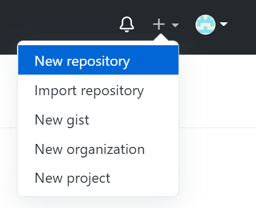
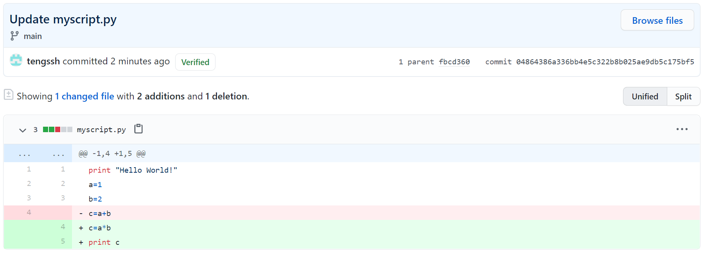

# Getting Started with Github & Git
- [Quick Start](#quick-start)
- [Adding Collaborators](#adding-collaborators)
- [Using Git](#using-git)
- [Miscellaneous](#miscellaneous)
- [References](#references)

## Quick Start
* Regisiter for a Github account
* Create a new repository <br />
  1. Select **New repository** from the drop menu <br />
   <br />  
  2. Create a new repository <br />
   <br />
* Upload files <br />
   <br />
* Edit files & commit changes <br />
  1. Click the “Edit” button <br />
   <br />
  2. Commit changes <br />
   <br />
* History versions <br />
  1. Click “# commits” <br />
   <br />
  2. Show commits-history <br />
   <br />
  3. Show differences <br />
   <br />
* New branch <br />
  1. Type in the new branch’s name <br />
   <br />
   <br />
  2. Edit files & commit changes
* Pull request & merge
  1. Edit files & pull request <br />
   <br />
  2. Merge pull request <br />
   <br />
* Revert changes <br />
   <br />

## Adding Collaborators
* Manage Access <br />
1. Click “Settings/Manage Access” <br />
 <br />
2. Invite collaborator(s) <br />
 <br />

## Using Git
* Create a new repository
* Clone from remote <br />
  - In your Github page <br />
   <br />
  - In your local machine
    ```bash=
    $ git clone <HTTPS_ADDRESS>
    ```
* Git configuration
```bash=
$ git config --global user.name "name"
$ git config --global user.email "username@users.noreply.github.com"
```
* Edit files from local
* Push to remote
  1. Add changes in the *working directory* to the *staging area*
    ```bash=
    $ git add <YOUR_FILES>
    ```
  2. Commit changes to the local *repository*
    ```bash=
    $ git commit -m "YOUR COMMENTS"
    ```
  3. Push to the remote
    ```bash=
    $ git push origin main
    ```
* List history versions
  ```bash=
  $ git log
  ```
* Reset changes
```bash=
  $ git reset <COMMIT>
  ```
* Revert changes (hard reset)
```bash=
  $ git revert <COMMIT>
  ```
* New branch
  1. List current branches
  ```bash=
  $ git branch
  ```
  2. Create a new branch
  ```bash=
  $ git branch <NEW_BRANCH>
  ```
  3. Switch branch
  ```bash=
  $ git checkout <BRANCH>
  ```

## Miscellaneous
* `git status`: Check status
* `git diff`: Compare difference between working directory & local repository

## References
- Github
  - http://guides.github.com/activities/hello-world/
  - https://docs.github.com/en/github/getting-started-with-github/quickstart
- Git
  - https://docs.github.com/en/github/getting-started-with-github/set-up-git
  - http://swcarpentry.github.io/git-novice/
  - https://www.freecodecamp.org/news/learn-the-basics-of-git-in-under-10-minutes-da548267cc91/
